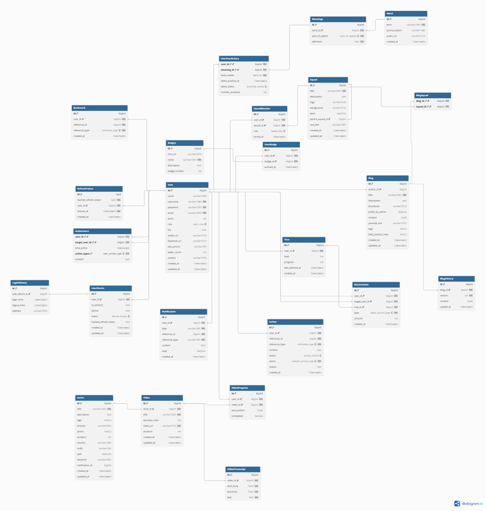

# 

## Technologies

- **Prisma**: ORM for database management
- **Health Check**: @nestjs/terminus - Check all services
- **Logger**: Winston (Global Module)
- **Wrapper Microservice Request**: Send request to microservice and handle response/error in a standard way
- **Swagger Documentation**: Auto-generate API docs with Swagger module
- **Exception Filter**: Global exception filter to catch unhandled exceptions and return proper response

---

## Features

### Cursor-Based Pagination
Implement cursor-based pagination for efficient data retrieval
- No need for SKIP operations
- Takes advantage of indexed columns
- Better performance for large datasets

---

## Services Architecture

### API Gateway
**Services:**
- Auth-Service ✅
- User-Service 🔄
- Dictionary-Service ⏳
- Content-Service ⏳
- Media-Service ⏳
- Gamification-Service ⏳
- Notification-Service ⏳

**Nhiệm vụ:**
| Chức năng | Trạng thái |
|----------|-----------|
| Tiếp nhận request của client | ❌ |
| Tổng hợp các service | 🔄 |
| Kiểm tra danh tính hợp lệ (JWT) | ✅ |
| Rate limiting | ⏳ |
| IP WhiteList | ⏳ |
| Caching | ⏳ |
| Load Balancing | ⏳ |
| CORS | ⏳ |

---

### Auth Service
**Entities:**
- RefreshToken
- User (Đăng nhập, Đăng ký)
- UserDevice
- LoginHistory

**Nhiệm vụ:**
| Chức năng | Trạng thái |
|----------|-----------|
| Đăng ký | ✅ |
| Đăng nhập | ✅ |
| Lấy accessToken mới | ✅ |
| Đăng xuất | ✅ |
| Đăng xuất tất cả thiết bị | ✅ |

**Tính năng:**
- ✅ JWT Refresh Token (Hashed and stored in DB)
- ✅ Secret and expiry (15m)
- ✅ Bcrypt hashing password + refresh tokens
- ✅ Multiple device login support
- ✅ Custom error handling with exceptions
- ✅ Input validation with class-validator
- ✅ BigInt Serializer Interceptor (handle BigInt in JSON responses)

**Cần bổ sung:**
- Rate limiting
- Email verification
- Password reset
- 2FA
- Audit logging

---

### User Service
**Entities:**
- User
- ActionUser

**Nhiệm vụ:**
| Chức năng | Trạng thái |
|----------|-----------|
| Lấy thông tin người dùng | ✅ |
| Gợi ý typing tìm người dùng | ✅ |
| Tìm người dùng | ✅ |
| Cập nhật thông tin | ✅ |
| Theo dõi người dùng | ✅ |
| Hủy theo dõi | ✅ |
| Chặn người dùng | ✅ |
| Bỏ chặn | ✅ |
| Báo cáo người dùng | ✅ |
| Hủy báo cáo | ✅ |
| Lấy người đang theo dõi (infinity-scroll) | ✅ |
| Lấy người theo dõi mình (infinity-scroll) | ✅ |
| Cập nhật cài đặt (thông báo, riêng tư) | 🔄 |

**Tính năng:**
- ✅ User profile management (CRUD operations)
- ✅ Cursor-based pagination for user search
- ✅ Follow/Unfollow functionality
- ✅ Block/Unblock users
- ✅ Report/Unreport users
- ✅ Comprehensive DTOs with validation
- ✅ Production-grade error handling

---

### Dictionary Service
**Entities:**
- Word (id, thuật ngữ, phiên âm, đường dẫn âm thanh)
- Meanings (id, wordId, loại từ vựng, định nghĩa)

**Nhiệm vụ:**
| Chức năng | Trạng thái |
|----------|-----------|
| Tra cứu từ (chính xác / gần đúng) | ⏳ |
| Thêm từ mới | ⏳ |
| Thêm nghĩa cho từ | ⏳ |
| Chỉnh sửa từ (thuật ngữ, phiên âm, âm thanh) | ⏳ |
| Chỉnh sửa nghĩa từ (loại từ vựng, định nghĩa) | ⏳ |
| Xóa từ (cascade xóa tất cả nghĩa) | ⏳ |
| Xóa nghĩa của từ | ⏳ |

---

### Content Service
**Entities:**
- Blog
- BlogHistory
- Squad
- SquadMember
- BlogSquad

**Nhiệm vụ:**
| Chức năng | Trạng thái |
|----------|-----------|
| CRUD Blog | ⏳ |
| Quản lý phiên bản (BlogHistory) | ⏳ |
| CRUD Squad (Chủ đề) | ⏳ |
| Tham gia / Rời Squad | ⏳ |
| Gắn Blog vào Squad | ⏳ |

---

### Media Service
**Entities:**
- Series
- Video
- VideoTranscript

**Nhiệm vụ:**
| Chức năng | Trạng thái |
|----------|-----------|
| Tải lên và mã hóa video (nhiều định dạng) | ⏳ |
| Streaming video (HLS/DASH) | ⏳ |
| CRUD Series | ⏳ |
| Quản lý video trong series | ⏳ |
| Quản lý phụ đề (VideoTranscript) | ⏳ |

---

### Learning Service
**Entities:**
- UserVocabulary
- VideoProgress

**Nhiệm vụ:**
| Chức năng | Trạng thái |
|----------|-----------|
| Theo dõi tiến độ từ vựng (levelMaster, lastestPracticeAt, latestStatus) | ⏳ |
| Cung cấp API luyện tập | ⏳ |
| Theo dõi tiến độ xem video (latestPosition, completed) | ⏳ |

---

### Gamification Service
**Entities:**
- (Định nghĩa entities...)

**Nhiệm vụ:**
| Chức năng | Trạng thái |
|----------|-----------|
| (Định nghĩa chức năng...) | ⏳ |

---

### Notification Service
**Entities:**
- Notification

**Nhiệm vụ:**
| Chức năng | Trạng thái |
|----------|-----------|
| Lắng nghe và tạo bảng ghi thông báo | ⏳ |
| Gửi thông báo đến user real-time | ⏳ |

---

## Commit Guidelines

Format: `<type>(<scope>): <subject>`

**Example:** `feat(auth): add login endpoint`

### Types:
- `feat` - New feature
- `fix` - Bug fix
- `refactor` - Code refactoring
- `style` - Code style changes (formatting, etc)
- `docs` - Documentation changes
- `test` - Adding or updating tests
- `chore` - Other changes that don't modify src or test files

### Scopes:
- auth, user, common, gateway, prisma, etc

### Subject:
- Brief description of the change

---

## Development Setup

### DotEnv
```bash
pnpm add dotenv
# Create .env file in root directory
# Load env variables in main.ts: import 'dotenv/config';
```

### Prisma
```bash
pnpm add prisma @prisma/client
pnpm prisma init
# Configure datasource in .env
pnpm prisma db pull --schema src/prisma/schema.prisma
pnpm prisma generate --schema src/prisma/schema.prisma
```

### Health Check
```bash
pnpm add @nestjs/terminus @nestjs/axios
# Create HealthModule and healthIndicators: rabbitmq, database, etc...
# Add HealthController with /health endpoint
```

### Microservice
```bash
pnpm add @nestjs/microservices amqplib amqp-connection-manager
# Configure microservice options in main.ts
# Create api gateway to route requests to microservices
```

### Logger
```bash
pnpm add winston winston-daily-rotate-file
pnpm add -D @types/winston
# Create LoggerModule as global module
```


# Architecture Diagram
`v0` <br>
<br>


